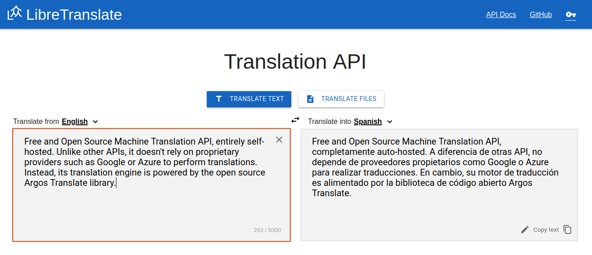

# Argos Translate
[Docs](https://argos-translate.readthedocs.io) | [Website](https://www.argosopentech.com) | [Video intro](https://youtu.be/yn37-CpRzTc)

Open-source offline translation library written in Python. Uses [OpenNMT](https://opennmt.net/) for translations, [SentencePiece](https://github.com/google/sentencepiece) for tokenization, [Stanza](https://github.com/stanfordnlp/stanza) for sentence boundary detection, and [PyQt](https://riverbankcomputing.com/software/pyqt/intro) for GUI. Designed to be used as either a Python library, command-line, or GUI application. [LibreTranslate](https://libretranslate.com) is an API and web-app built on top of Argos Translate.

Argos Translate supports installing model files which are a zip archive with an ".argosmodel" extension that contains an OpenNMT [CTranslate2](https://github.com/OpenNMT/CTranslate2) model, a [SentencePiece](https://github.com/google/sentencepiece) tokenization model, a [Stanza](https://github.com/stanfordnlp/stanza) tokenizer model for sentence boundary detection, and metadata about the model. Pretrained models can be downloaded [here](https://www.argosopentech.com/argospm/index/).

Argos Translate also manages automatically pivoting through intermediate languages to translate between languages that don't have a direct translation between them installed. For example, if you have a es ➔ en and en ➔ fr translation installed you are able to translate from es ➔ fr as if you had that translation installed. This allows for translating between a wide variety of languages at the cost of some loss of translation quality.

## Models
- [Browse models](https://www.argosopentech.com/argospm/index/)
- [P2P download (IPFS and BitTorrent)](/p2p/README.md)
- [Training script](https://github.com/argosopentech/onmt-models)
- [Google Drive download](https://drive.google.com/drive/folders/11wxM3Ze7NCgOk_tdtRjwet10DmtvFu3i)

### Supported languages
- Arabic
- Chinese
- English
- French
- German
- Hindi
- Indonesian
- Irish
- Italian
- Japanese
- Korean
- Polish
- Portuguese
- Russian
- Spanish
- Turkish
- Ukranian
- Vietnamese
- [Request languages](https://github.com/argosopentech/argos-translate/discussions/91)

## Examples
### GUI


### Python
```
from argostranslate import package, translate
package.install_from_path('en_es.argosmodel')
installed_languages = translate.get_installed_languages()

>>> [str(lang) for lang in installed_languages]
>>> ['English', 'Spanish']

translation_en_es = installed_languages[0].get_translation(installed_languages[1])
translation_en_es.translate("Hello World!")

>>> '¡Hola Mundo!'
```

### Command Line
```
argos-translate --from-lang en --to-lang es "Hello World"
Hola Mundo

echo "Text to translate" | argos-translate --from-lang en --to-lang es
Texto para traducir
```

### [LibreTranslate](https://github.com/uav4geo/LibreTranslate) Web App ([Demo](https://libretranslate.com/))


### [LibreTranslate](https://github.com/uav4geo/LibreTranslate) API
```
const res = await fetch("https://libretranslate.com/translate", {
	method: "POST",
	body: JSON.stringify({
		q: "Hello!",
		source: "en",
		target: "es"
	}),
	headers: {
		"Content-Type": "application/json"}
	});

console.log(await res.json());

{
    "translatedText": "¡Hola!"
}
```

### HTML Translation
The [translate-html](https://github.com/argosopentech/translate-html) library is built on top of Argos Translate and [Beautiful Soup](https://beautiful-soup-4.readthedocs.io/en/latest/) and parses and translates HTML.

## Installation
### Install from PyPI
Argos Translate is available from [PyPI](https://pypi.org/project/argostranslate/) and can be installed with pip.
```
python3 -m pip install --upgrade pip
python3 -m pip install argostranslate
```
### Purchase for macOS
[Buy](https://github.com/argosopentech/argos-translate/discussions/131)


 
### Install from Snap Store
Argos Translate is available from the Snap Store and auto installs a content snap to support translation between Arabic, Chinese, English, French, Russian, and Spanish. Additional languages can be installed from supplementary content snaps.

With [snapd installed](https://snapcraft.io/docs/installing-snapd):
```
sudo snap install argos-translate
``` 
[](https://snapcraft.io/argos-translate)

Automatically installs and connects to `argos-translate-base-langs` snap to support translations between Arabic, Chinese, English, French, Russian, and Spanish.

Additional languages can be installed from *.argosmodel files or from supplementary content snaps:
* argos-translate-de-en - German - English
* argos-translate-en-it - English - Italian
* argos-translate-en-pt - English - Portuguese

To connect automatically:
`sudo snap connect argos-translate:argos-packages argos-translate-en-it:argos-packages`

To run command line interface on Snapcraft:
```
argos-translate.cli --help
```

### Installation for Windows
CTranslate2, the inference engine for Argos Translate, [currently only distributes binaries for Linux and MacOS](https://github.com/OpenNMT/CTranslate2/issues/133) so to install Argos Translate on Windows you will need to build CTranslate2 from source.

### Python source installation
#### Dependencies
Requires Python3, pip (which should come with Python3), and optionally virtualenv to keep Argos Translate's dependencies separate from other Python programs you have installed.

[Python Installation Instructions](https://wiki.python.org/moin/BeginnersGuide/Download)

On Ubuntu:
```
sudo apt-get update
sudo apt-get install -y python3
```
#### Install
1. Download a copy of this repo (this requires either installing git or downloading a zip from GitHub):
```
git clone https://github.com/argosopentech/argos-translate.git
cd argos-translate
```
2. Make a virtual environment to install into (optional):
```
python3 -m pip install --upgrade virtualenv # If virtualenv not already installed
virtualenv env
source env/bin/activate
```
3. Install this package with pip:
```
python3 -m pip install --upgrade pip
python3 -m pip install .
```

### GPU Acceleration

To enable GPU support, you need to set the `ARGOS_DEVICE_TYPE` env variable to `cuda` or `auto`.

```
$ ARGOS_DEVICE_TYPE=cuda argos-translate --from-lang en --to-lang es "Hello World"
Hola Mundo
```

The above env variable instructs [CTranslate2](https://github.com/OpenNMT/CTranslate2) to use cuda.
if you encounter any issues with GPU, please consider reading [CTranslate2 documentation](https://github.com/OpenNMT/CTranslate2#what-hardware-is-supported).


### Build and install snap package
1. Install [snapd](https://snapcraft.io/docs/installing-snapd) if it isn't already installed.
2. Using snapd install snapcraft and its dependency multipass:
```
sudo snap install multipass
sudo snap install snapcraft
```
3. Clone this repo:
```
git clone https://github.com/argosopentech/argos-translate.git
cd argos-translate
```
4. From the root directory of this project build the snap package:
```
SNAPCRAFT_BUILD_ENVIRONMENT_MEMORY=4G snapcraft
```
Any *unzipped* package files in package/ will be automatically included in the snap archive (and won't be able to be deleted by users of the snap).

Note, the build won't run with Snapcraft's default build memory of 2GB so you need to set the SNAPCRAFT_BUILD_ENVIRONMENT environment variable. [More on Snapcraft forum](https://forum.snapcraft.io/t/snapcraft-configuration-of-multipass-vm-arguments/9761).

5. Install the snap package:
```
sudo snap install --devmode argos-translate_<version information>.snap
```
### Run Argos Translate!
```
argos-translate
argos-translate-gui
```

When installing with snap a .desktop file should also be installed which will make Argos Translate available from the desktop menu.

## Uninstall

If you want to uninstall Argos Translate, you may choose the applicable method.

### Uninstall PYPI/pip package

If you installed Argos Translate via `pip` you can uninstall it using

``` shell
python3 -m pip uninstall argostranslate
```

You may choose to also delete temporary and cached files:

``` shell
rm -r ~/.local/cache/argos-translate
rm -r ~/.local/share/argos-translate
```

### Uninstall Snap

The following command will uninstall the snap package.

``` shell
sudo snap remove argos-translate argos-translate-base-langs
```

If you installed additional language packs, you might want to remove them as well, e.g.

``` shell
sudo snap remove argos-translate-de-en
```

## Contributing
[](https://github.com/humanetech-community/awesome-humane-tech)

Contributions are welcome! Available issues are on the [GitHub issues page](https://github.com/argosopentech/argos-translate/issues).

## Support
For support use [GitHub Issues](https://github.com/argosopentech/argos-translate/issues), [Github Discussions](https://github.com/argosopentech/argos-translate/discussions), or the [LibreTranslate Forum](https://community.libretranslate.com/c/argos-translate/5).

## Custom models
Custom models trained on your own data are available for $1000/each (negotiable).

## Donations
If you find this software useful donations are appreciated.
- [GitHub Sponsor](https://github.com/sponsors/argosopentech)
- [PayPal](https://www.paypal.com/biz/fund?id=MCCFG437JP9PJ)
- Ethereum: 0x4E9017d8e275cA54C91E056381DAb9fe6ECC1AF6
- Bitcoin cash: qzqklgjpgutdqqlhcasmdd2hkqcelw426sxzk5qtne
- Bitcoin: 16UJrmSEGojFPaqjTGpuSMNhNRSsnspFJT
- Filecoin: f1nrnpmjxn27amidyiqrzq5mxihdo2trh2oijw2sq
- Basic Attention Token: 0x8a16f26D277f924B04FCA5ECec64b76B5410A06c
- Cheap Eth: 0x996133E61b81c300a37ACa9b24898685eB872b61

Paid supporters receive priority support.

## License
Dual licensed under either the [MIT License](https://github.com/argosopentech/argos-translate/blob/master/LICENSE) or [CC0](https://creativecommons.org/share-your-work/public-domain/cc0/).

